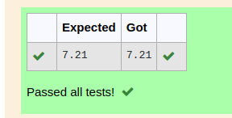

# DISTANCE-BETWEEN-TWO-POINTS

## AIM:
To write a python program to find the distance between 2 points
## ALGORITHM:
### Step 1: 
Import the math module to use the built-in functions for calculation

### Step 2: 
Allign the two points as x2 and x1
### Step 3: 
Substitute the values in the distance formula  
### Step 4: 
Print the value
### Step 5: 
End the program
### PROGRAM:

```
#Program to find the distance between two points .
#Developed by: Akshayaa M
#RegisterNumber:22008405
import math
x2=[10,6]
x1=[4,2]
dist=math.sqrt(((x2[0]-x1[0])**2)+((x2[1]-x1[1])**2))
print("{:.2f}".format(dist))
```


### OUTPUT:

### RESULT:
Thus the distance between 2 points was found successfully by using a python program.